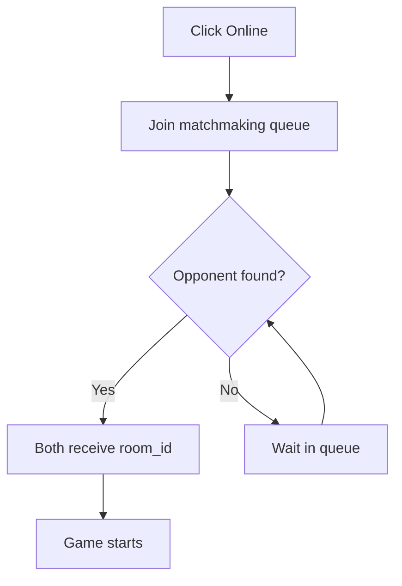
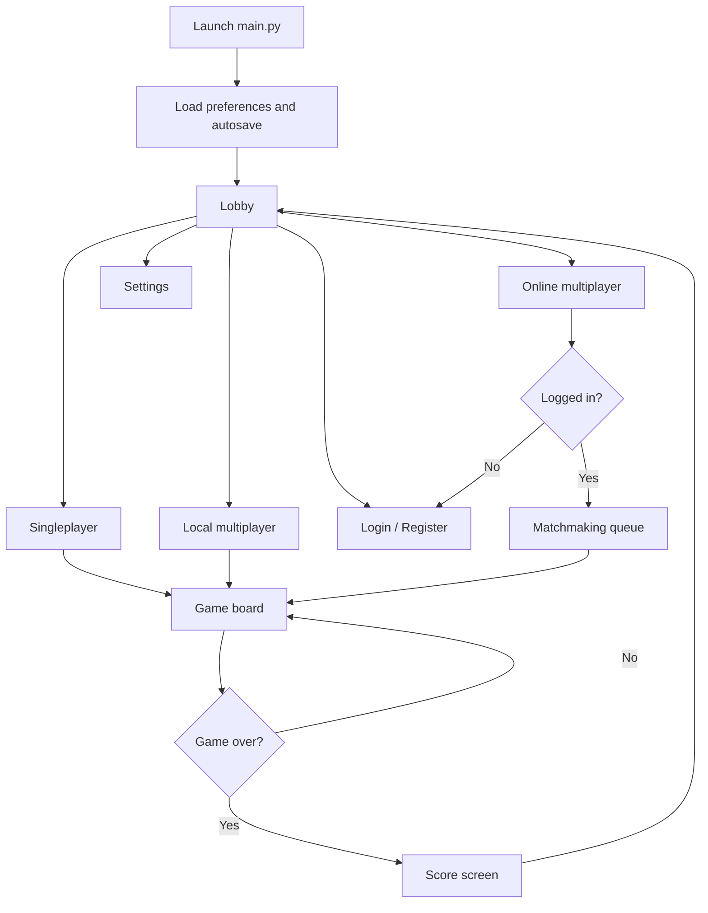

# CS Go (Desktop Client)

A desktop Go board game built with Python and Tkinter. Play solo against the AI 🤖, locally with a friend on the same machine 👥, or online against other players via the CS Go server 🌐.

## ✨ Features
- 🎯 Three board sizes: 9×9, 13×13, 19×19
- 🎮 Three game modes: singleplayer, local 2-player, online multiplayer
- 🧠 Four AI difficulty levels: Martin (easy), Leo (medium), Magnus (hard), KataGo (strongest)
- 👤 Online account, profile picture, friends list, and messaging
- 🔗 Online matchmaking by level via WebSocket
- 🔊 Sound and music with independent volume controls
- 💾 Auto-save and preference persistence across sessions
- 🏆 Chinese-style scoring with full Go rules (captures, ko, territory)

## 🛠️ Prerequisites
- Python `3.12`
- Windows (KataGo AI engine is bundled as a Windows executable)

## 📦 Install

```powershell
python -m venv .venv
.venv\Scripts\Activate.ps1
pip install -r requirements.txt
```

## ▶️ Run

```powershell
python main.py
```

The app window opens directly — no browser, no server needed for local play.

## 🎮 Game Modes

### 🤖 Singleplayer
Play against one of four AI opponents. Select board size and difficulty in the lobby.

| AI | Difficulty | Engine |
|----|-----------|--------|
| Martin | 🟢 Easy | Random moves |
| Leo | 🟡 Medium | Basic strategy |
| Magnus | 🔴 Hard | Deeper lookahead |
| KataGo | ☠️ Strongest | Neural network (bundled) |

### 👥 Local Multiplayer
Two players take turns on the same machine. No account or internet required.

### 🌐 Online Multiplayer

The online mode connects to the CS Go server over a persistent WebSocket connection. It handles account auth, matchmaking, direct invites, in-game moves, chat, and automatic reconnection.

#### 1. 🔐 Account
An account is required for online play.
- Click **Login** in the lobby to sign in with existing credentials.
- Click **Register** to create a new account (username + password + display name).
- Enable **Stay logged in** to remember your token across sessions — you won't need to log in again on the next launch.
- Manage your account from the **Account** panel: change display name, password, or profile picture (any JPEG/PNG/WebP up to 5 MB).

#### 2. 🔎 Matchmaking
Once logged in, click **Online** to enter the matchmaking queue.
- The server pairs you with the opponent whose level is closest to yours.
- A match is found instantly if another player is already waiting.
- Your level is updated automatically after each game.



#### 3. 📨 Direct Invitations
Prefer to play against a specific friend? Use direct invitations instead of the queue.
1. Open the **Social** panel and find your friend in the friends list.
2. Click the **Invite** button next to their name.
3. Your friend receives an in-app notification and can **Accept** or **Decline**.
4. On accept, both players are sent to the same game room.

#### 4. 🎲 In Game
Once a room is joined, all moves and chat messages are relayed in real time.
- Each stone placement is broadcast to the opponent immediately.
- Colors (black/white) are assigned randomly at match start.
- Use the **Chat** panel during the game to send short messages or emojis to your opponent 😄.

#### 5. 🔄 Reconnection
The WebSocket client handles transient network failures transparently:
- If the connection drops, it retries automatically with exponential backoff (1 s → 2 s → 4 s … up to 30 s).
- The lobby reconnects and re-identifies with your username and token on each retry.
- Already-started games are not interrupted — rejoin the room by reconnecting before the opponent resigns.

## 🕹️ In-Game Controls
- 🖱️ **Click** on an intersection to place a stone
- ⏭️ **Pass** button — skip your turn
- 🏳️ **Resign** button — forfeit the game
- 💾 **Save** button — save the current game
- 📖 **Rules** button — display the Go rules
- 💬 **Chat** panel (online only) — send a message to your opponent

## 🗂️ Project Structure

```
main.py              Entry point
config.py            Constants: API URL, paths, defaults
game/
  core.py            Board engine (Goban, GoGame, scoring, ko rule)
  utils.py           Save/load helpers
gui/
  app.py             Main Tk window and frame navigation controller
  game_canvas.py     Board rendering and stone animations
  sound_manager.py   Background music and sound effects
  widgets.py         Shared UI components
  frames/
    lobby_frame.py   Main menu (mode select, account panel)
    game_frame.py    In-game board, controls, chat
    local_lobby_frame.py  Local 2-player setup
    account_frame.py Profile, stats, profile picture
    social_frame.py  Friends list, messaging
    login_dialog.py  Login and register dialog
    settings_frame.py Volume and preferences
  images/            Icons, board textures, profile photos
  sounds/            Music and sound effects (wav)
multiplayer/
  client.py          WebSocket client for online play
player/
  ai.py              AI player implementations
  katago/            Bundled KataGo engine and model files
saves/               Auto-saved game files
```

## 🗺️ App Navigation Flow



## ⚙️ Configuration

All constants are in `config.py`. The most likely ones to change:

| Constant | Default | Description |
|----------|---------|-------------|
| `BASE_URL` | `https://cs-go-production.up.railway.app` | REST API base URL |
| `WS_URL` | `wss://cs-go-production.up.railway.app/ws` | WebSocket URL |
| `DEFAULT_BOARD_SIZE` | `19` | Board size on first launch |
| `DEFAULT_VOLUME` | `50` | Master volume on first launch |

Preferences (volume, stay-logged-in, token) are saved locally in `preferences.prefs` and restored on the next launch.

## 📝 Notes
- 🪟 KataGo only runs on Windows. On other platforms, only Martin, Leo, and Magnus are available.
- 📶 An active internet connection is needed only for online multiplayer and account features. All other modes work fully offline.
- 🚂 The `railway` branch contains the server-side FastAPI service that powers the online features.
